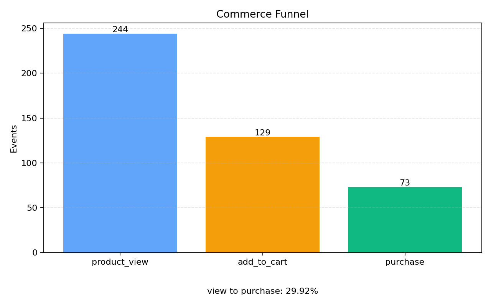

# Mini Commerce Event Log Pipeline

미니 커머스 사용자 행동 이벤트를 **생성 → 저장 → 분석 → 시각화**하는 배치 데이터 파이프라인.
`docker compose up --build` 한 번으로 전체 스택(앱 + PostgreSQL)이 실행됩니다.

**Stack** · Python · PostgreSQL · matplotlib · Docker Compose · pytest

---

## Quick Start

```bash
git clone https://github.com/GukDaHye/mini-event-log-pipeline.git
cd mini-event-log-pipeline
docker compose up --build
# DB 기동 → 스키마 생성 → 이벤트 1,000건 생성·저장 → 차트 생성까지 자동 수행
```

완료 후 `output/`에 차트 PNG가 생성됩니다.
스키마를 바꾼 뒤 재실행할 땐 `docker compose down -v` 로 DB 볼륨을 초기화하세요.
앱 작업 완료 후 컨테이너까지 자동 종료하고 싶다면 `docker compose up --build --abort-on-container-exit --exit-code-from app`을 사용하세요.

## What it does

1. 5종 이벤트(`page_view` · `product_view` · `add_to_cart` · `purchase` · `error`)를 **현실적 퍼널 비율**(45/25/12/8/10%)로 랜덤 생성
2. PostgreSQL `events` 테이블에 **필드 단위로 정규화** 저장 (JSON 통째 저장 X)
3. SQL 집계 5종 — 타입 분포 / 시간대 추이 / 에러 비율 / 상품 매출 / **퍼널 전환**
4. matplotlib로 차트 이미지 저장 (`output/*.png`)

## 결과 미리보기

| 차트 | 보여주는 것 |
|---|---|
| `event_type_counts.png` | 트래픽 분포·퍼널 폭 |
| `hourly_trend.png` | 시간대별 이벤트 추이 |
| `error_ratio.png` | 운영 안정성(에러 비율) |
| `top_products_revenue.png` | 매출 기여 상품 Top10 |
| `funnel.png` | 조회→장바구니→구매 전환 |



## Test

```bash
docker compose run --rm app pytest
```

## 더 보기

- 설계 의도 · 스키마 · 의사결정 상세 → **[docs/DESIGN.md](docs/DESIGN.md)**
- (선택) Kubernetes 배포 manifest → **[k8s/](k8s/)**
